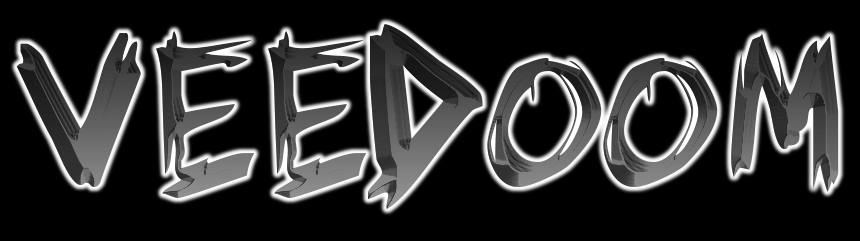

> A virtual DOM compiled to WebAssembly for max perf gains :muscle:. Implements the Myers diff algorithm for diffing children.

## Usage

Just run `python -m http.server` or any other static server from the root of this project, and then check out the `index.html` page. What you see, while not very impressive, was rendered via WebAssembly.

## Work In Progress

Eventually you should be able to swap out the React virtual DOM for this one, but not right now, there is still much to do.

- All of the logic for the tree exists and works, including the child diffing algorithm
- DOM nodes can be created and rendered to the page
- ...but the two aren't connected yet

Once connected, you should be able to trigger changes in the app that will then go through VeeDoom which will update the DOM accordingly.

Also TODO:

- Publish the package on NPM and maybe Crates if that's a thing
- Whip up a full example with JSX and Parcel to make sure it works in the real world
- Reduce the size with WeeAlloc
- Migrate the tests to `wasm_bindgent_test`

## The Myers Diff Algorithm

I have implemented the first, and simplest of the algorithms from [the paper](http://xmailserver.org/diff2.pdf). It would definitely be an improvement to use the linear space refinement.

## Development

You will need Rust, Node, and [wasm-pack](https://rustwasm.github.io/docs/wasm-pack/) installed.

Then run `wasm-pack build --target web` from the root. This should create the VeeDoom JavaScript loader and WASM file in a directory called `pkg`.

See the `index.html` and `main.mjs` files for an example of how to load it without a bundler.
